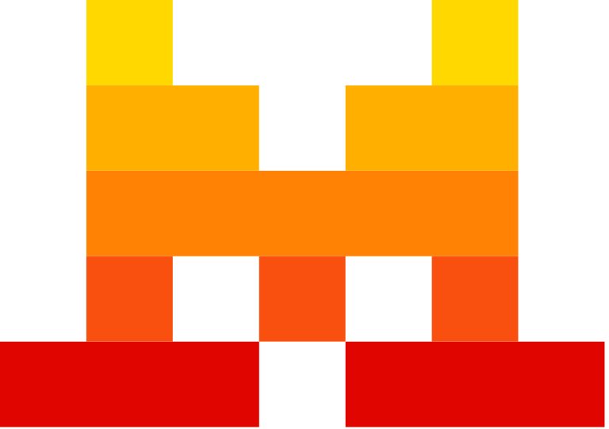

# AI Websites

This folder contains a curated list of popular AI chatbots and large language model (LLM) platforms. Each entry includes a name, code, direct URL, and icon for easy reference and integration.

## Overview
AI tools are transforming productivity, creativity, and research. This collection helps you quickly find and use leading AI chatbots and platforms.

## Table of AI Websites

| Icon | Name        | Code     | URL |
|------|-------------|----------|-----|
|  | **AI**   |      |     |
|  | ChatGPT | chatgpt | https://chat.openai.com/?q={} |
|  | Perplexity | ppx | https://www.perplexity.ai/search?q={} |
|  | Claude | claude | https://claude.ai/new?q={} |
|  | Copilot | copilot | https://copilot.microsoft.com/?q={} |
|  | HuggingChat | hf | https://huggingface.co/chat?q={} |
|  | Mistral | mistral | https://chat.mistral.ai/chat?q={} |

## How to Use
- Browse the table above or use `ai.json` for programmatic access.
- Integrate these links into your own tools, dashboards, or browser extensions.
- Use the code field for quick lookups or as a search shortcut.

## Contributing
- Add new AI platforms by editing `ai.json` and adding a PNG icon to `icon/`.
- Update this README table to reflect your changes.
- Ensure all links and icons are correct.

## Example Integration
You can use the JSON file to build a launcher, chatbot aggregator, or browser extension that lets users search or open any AI platform with a single click. 